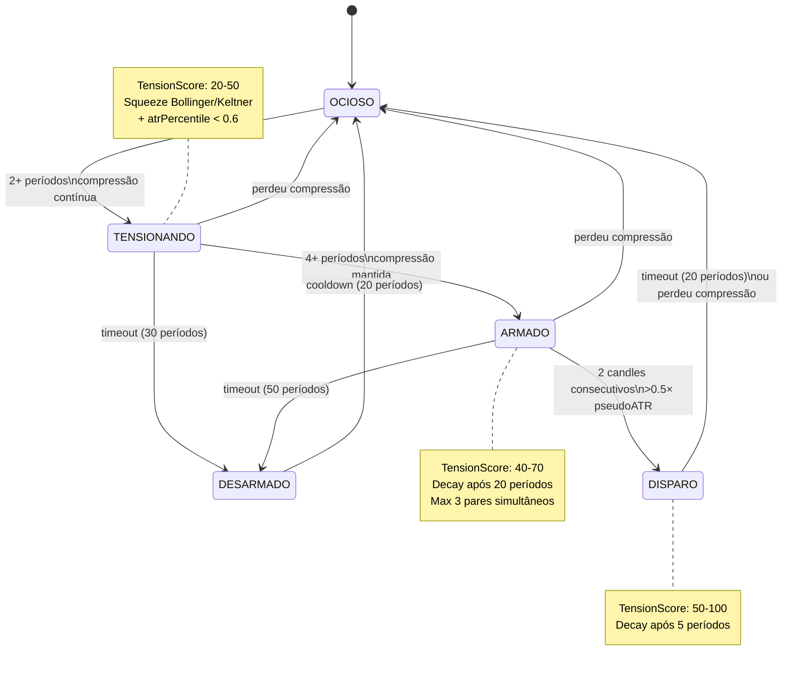
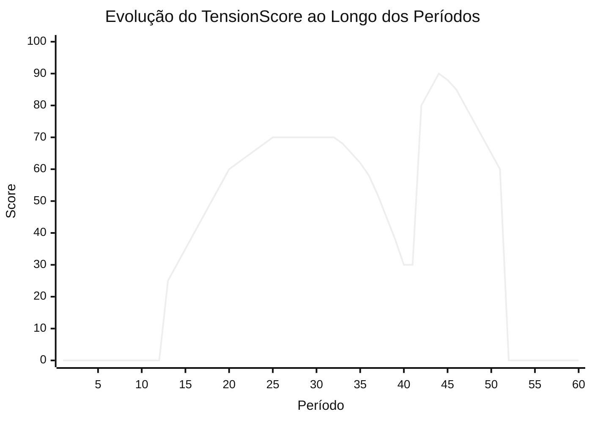

# Arqueiro — Modulador de Tensão/Timing

## Diagrama de Estados



## Curva de TensionScore



**Legenda:**
- Período 1-11: OCIOSO — sem sinal
- Período 12-13: TENSIONANDO — compressão detectada, score 20-30
- Período 14-21: ARMADO — score sobe de 40 a 70
- Período 22-38: ARMADO com decay após período 32 → score cai
- Período 39: DESARMADO — cooldown
- Período 40-49: DISPARO — breakout confirmado, score salta para 80-95, decay após período 46
- Período 50+: volta a OCIOSO

## Núcleo do Algoritmo

### Squeeze Binário (Bollinger + Keltner)

```typescript
private detectSqueeze(ps: PairState): boolean {
  // Bollinger: stddev dos últimos 20 preços
  const std = Math.sqrt(variance)
  const bw = 2 * BOLLINGER_STDDEV * std / mean

  // Keltner: pseudoATR curto (20 períodos), mesma janela da leitura Bollinger
  const kw = 2 * KELTNER_ATR_MULT * ps.pseudoATRShort / mean

  return bw < kw  // squeeze ativo
}
```

### Pseudo-ATR (sem OHLC)

```typescript
// Returns absolutos em vez de High-Low verdadeiro
// (DEX Arc/Polygon só expõe preço spot, sem OHLC)
private absoluteReturns(ps: PairState): number[] {
  const r: number[] = []
  for (let i = 1; i < ps.prices.length; i++) {
    const prev = ps.prices[i - 1].price
    if (prev > 0)
      r.push(Math.abs((ps.prices[i].price - prev) / prev))
  }
  return r
}
```

### Máquina de Estados + TensionScore

```typescript
private computeScore(ps: PairState, state: StateName): number {
  // Quão comprimido está? 0 = normal, 1 = extremo
  const norm = Math.max(0, Math.min(1,
    (COMPRESSION_THRESHOLD - ps.atrPercentile) / COMPRESSION_THRESHOLD
  ))
  switch (state) {
    case "OCIOSO": case "DESARMADO": return 0
    case "TENSIONANDO":
      return Math.round(Math.min(50, Math.max(0, 20 + 30 * norm)))
    case "ARMADO": {
      let s = Math.round(Math.min(70, Math.max(40, 30 + 40 * norm)))
      if (ps.periodsInState > DECAY_START)           // decay após 20 períodos
        s = Math.round(s * Math.max(0, 1 - (ps.periodsInState - DECAY_START) / DECAY_FULL))
      return s
    }
    case "DISPARO": {
      let s = Math.round(Math.min(100, Math.max(50, 50 + 50 * norm)))
      if (ps.periodsInState > 5)                     // decay após 5 períodos
        s = Math.round(s * Math.max(0.3, 1 - (ps.periodsInState - 5) / DISPARO_TIMEOUT))
      return s
    }
  }
}
```

## Integração no Pregão

```
verificarOrdem()                  executarPacotes()
       │                                │
       │ feedPrice (fire-and-forget)     │
       ├─────────────────────────────────┤
       │ getScore(pair, rede)            │
       │    ↓                            │
       │  se > 0:                        │  média dos scores dos trades
       │  confiança *= 1 + 0.3 × score%  │  score *= 1 + 0.2 × avgTension%
       │    ↓                            │      ↓
       │  CapitalController              │  CapitalController
       │  (gate binário)                 │  (gate binário)
```

## Parâmetros

| Parâmetro | Valor | Descrição |
|-----------|-------|-----------|
| SHORT_WINDOW | 20 | Períodos para pseudoATR curto |
| LONG_WINDOW | 100 | Períodos para pseudoATR longo |
| COMPRESSION_THRESHOLD | 0.6 | atrPercentile < 0.6 = comprimido |
| BOLLINGER_STDDEV | 2 | Largura Bollinger em desvios padrão |
| KELTNER_ATR_MULT | 1.5 | Largura Keltner em pseudoATR |
| DECAY_START | 20 | Decaimento começa após N períodos em ARMADO |
| DECAY_FULL | 40 | N períodos até decaimento completo em ARMADO |
| DISPARO_TIMEOUT | 20 | Timeout em DISPARO antes de voltar a OCIOSO |
| TENSIONANDO_TIMEOUT | 30 | Timeout em TENSIONANDO → DESARMADO |
| ARMADO_TIMEOUT | 50 | Timeout em ARMADO → DESARMADO |
| DESARMADO_COOLDOWN | 20 | Períodos de cooldown antes de OCIOSO |
| MAX_ARMED_PAIRS | 3 | Máximo de pares simultâneos em ARMADO/DISPARO |
| CYCLE_MS | 60000 | Tick do Arqueiro (60s) |
| RESET_THRESHOLD | 0.5 | Reset de calibração se ATR mudar >50% |
| MAX_HISTORY | 500 | Tamanho máximo do buffer de histórico por par |

## Fases de Rollout

| Fase | Status | Comportamento |
|------|--------|---------------|
| 1 — Shadow | ✅ Ativo | Score retorna 0. Apenas logs. |
| 2 — Validação | ⏳ | Score ativo. Monitorar acertos por ~7 dias. |
| 3 — Ativo | ⏳ | Operação irrestrita. |

## Alinhamento Arquitetural Futuro

O papel futuro recomendado para o Arqueiro é **Opportunity Scout / Pre-Intent Router**. Ele pode observar compressão, squeeze, timing e zonas de foco, mas não deve executar, aprovar, votar ou alterar a confiança final depois do Coordinator/Voting.

Fluxo alvo:

```text
Arqueiro detecta candidato
  -> ScoutSignal / OpportunityCandidate
  -> Knowledge Service valida contexto
  -> Coordinator recebe proposta
  -> Policy Engine verifica risco/gas/capital
  -> Voting Engine resolve consenso
  -> Adapter executa somente se aprovado
  -> Audit / DecisionReport registra o resultado
```

Enquanto estiver em Shadow, `getScore()` retorna `0`; os dados devem ser tratados como observacionais. Qualquer ativação futura deve preservar `executionAllowed: false` nos sinais do Arqueiro e manter a execução exclusivamente no ciclo canônico do ArcFlow.
